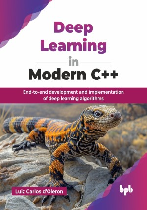

# Deep Learning in Modern C++

End-to-end development and implementation of deep learning algorithms .

This is the repository for [Deep Learning in Modern C++
](https://bpbonline.com/products/deep-learning-in-modern-c?variant=44600723079368),published by BPB Publications.

## About the Book
Deep learning is revolutionizing how we approach complex problems, and harnessing its power directly within C++ provides unparalleled control and efficiency. This book bridges the gap between cutting-edge deep learning techniques and the robust, high-performance capabilities of modern C++, empowering developers to build sophisticated AI applications from the ground up.

This book guides you through the entire development lifecycle, starting with a solid foundation in the modern features and essential libraries, like Eigen, for C++. You will master core deep learning concepts by implementing convolutions, fully connected layers, and activation functions, while learning to optimize models using gradient descent, backpropagation, and advanced optimizers like SGD, Momentum, RMSProp, and Adam. Crucial topics like cross-validation, regularization, and performance evaluation are covered, ensuring robust and reliable applications. Finally, you will dive into computer vision, building image classifiers and object localization systems, leveraging transfer learning for optimal performance.

By the end of this book, you will be proficient in developing and deploying deep learning models within C++, equipped with the tools and knowledge to tackle real-world AI challenges with confidence and precision.

## What You Will Learn
• Implement core deep learning models in modern C++.

• Code CNNs, RNNs, GANs, and optimization techniques.

• Build and test robust deep learning C++ applications.

• Apply transfer learning in C++ computer vision tasks.

• Master backpropagation and gradient descent in C++.

• Develop image classifiers and object detectors in C++.
